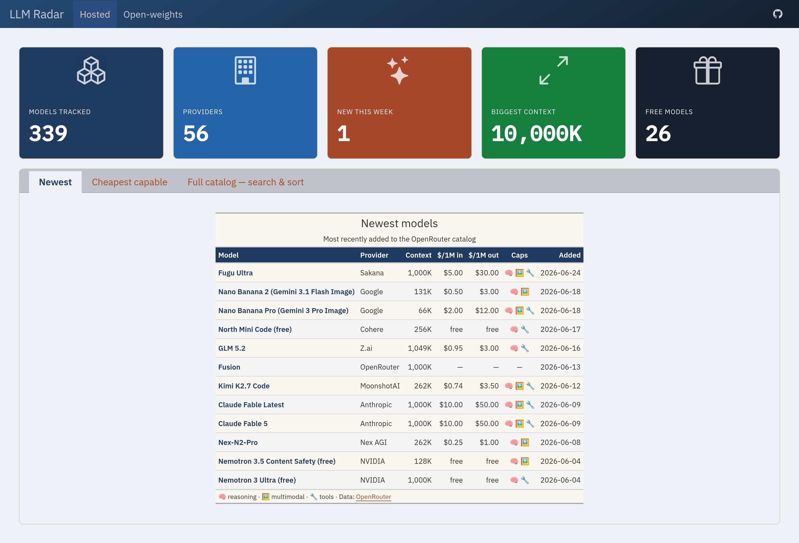

<p align="center">
  
</p>

<h1 align="center">LLM Radar</h1>

<p align="center">
  <strong>The full LLM landscape</strong> — hosted pricing & context (300+ models) plus open-weights adoption & licenses, auto-updated daily.
</p>

<p align="center">
  <a href="https://ronaldmego.github.io/llm-radar"></a>
  <a href="https://github.com/ronaldmego/llm-radar/actions/workflows/publish.yml"></a>
  <a href="LICENSE"></a>
</p>

<p align="center">
  
</p>

## Why

The LLM landscape moves weekly — new models, shifting prices, bigger context windows. Comparing them usually means juggling a dozen pricing pages. **LLM Radar** pulls the whole catalog into one view and keeps it current automatically, so you can see at a glance what's new, what's cheap, and what fits your context needs.

Two tabs — the **commercial** side you pay to call, and the **open** side you can self-host:

### Hosted (OpenRouter)
- **At-a-glance stats** — models tracked, providers, new this week, biggest context window, free models.
- **Newest models** · **Cheapest capable** (≥100K context, lowest input price) · **Full catalog** — searchable table with provider, context, `$/1M` in/out, modalities, date added.
- Capability flags: 🧠 reasoning · 🖼️ multimodal · 🔧 tools.

### Open-weights (Hugging Face)
- **At-a-glance stats** — open LLMs tracked, **permissive-license share**, **gated** (acceptance-required) count, orgs represented, new this week.
- **Most downloaded** · **Community favorites** (by likes) · **Catalog** — searchable table with org, 30-day downloads, likes, **license**, task, date added.
- License and the 🔒 gated flag are first-class: they're what decide whether a model can be self-hosted for data-residency or used commercially.

## How it works

```
OpenRouter API  ┐
                ├─►  Python (pandas + great-tables)  →  Quarto dashboard  →  GitHub Pages
Hugging Face API ┘
        \____________________ refreshed daily by GitHub Actions ____________________/
```

**Zero server, zero cost, no API key.** Both catalog endpoints are public, so a daily GitHub Actions cron re-fetches the data, re-renders the dashboard, and redeploys to GitHub Pages — no secrets, no backend.

## Run locally

Requires [uv](https://docs.astral.sh/uv/) and [Quarto](https://quarto.org) 1.8+.

```bash
git clone https://github.com/ronaldmego/llm-radar.git
cd llm-radar
uv run quarto preview index.qmd
```

To check the data pipeline alone:

```bash
uv run python src/data_processor.py
```

## Data sources

- [OpenRouter](https://openrouter.ai) — the public `/api/v1/models` catalog (hosted tab).
- [Hugging Face Hub](https://huggingface.co/models) — the public model listing API (open-weights tab).

LLM Radar is an independent project and is not affiliated with OpenRouter or Hugging Face.

## License

MIT — see [LICENSE](LICENSE).
